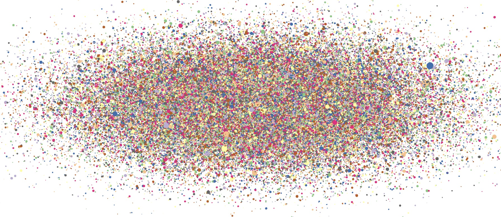

Rendering charts can be a very intensive operation for the browser, especially multiple charting widgets in the context of a wider application. OffscreenCanvas is growing in browser support and allows canvas rendering to be delegated to a WebWorker. This post looks at what performance improvements we can realistically expect and some gotchas that can crop up along the way.

## Why OffscreenCanvas?

The code involved in rendering a chart can be computationally expensive on its own. As has been [well documented elsewhere](https://developers.google.com/web/fundamentals/codelabs/web-perf), smooth interactions/animations require consistently rendering within the ~10ms frame budget to achieve 60fps. Worse still, overrunning on any frame will lead to noticeable lag for the user. 

However, when rendering charts this is often further exacerbated by -

* Large/multiple datasets/annotations - requires optimising the media-type (SVG/canvas/WebGL) on a per series/annotation basis or aggressive culling of offscreen data points.
* Being a small part of a larger application - requires consistently rendering within significantly less than 10ms to allow the other charts/widgets within the application time to render.

These challenges are ideal candidates for a classic divide and conquer approach, spreading the computation out accross multiple workers. However, before OffscreenCanvas all rendering code had to run within the main window in order to have access to the necessary APIs. 

*Technically it has always been possible for purely algorithmic code to be offloaded to a WebWorker. However, as the rendering calls still had to be made from the main window, this required a relative leap in messaging complexity within the chart often for neglibile gain.*

The OffscreenCanvas specification provides a way to transfer control of the drawing surface of a canvas element to a WebWorker. It is currently supported in Chrome and Edge (since its adoption of Chromium earlier this year). Firefox expects to have support by the second half of this year but Safari have yet to commented publically on support...

## Rendering A Chart Using OffscreenCanvas

[](https://chrisprice.io/offscreen-canvas/?100000)

To better understand some of the benefits and potential pitfalls, we'll work through an example of rendering the graphically intense chart shown above. 


```js
const offscreenCanvas = canvasContainer
  .querySelector('canvas')
  .transferControlToOffscreen();
const worker = new Worker('worker.js');
worker.postMessage({ offscreenCanvas }, [offscreenCanvas]);
```

First off we request an OffscreenCanvas from the `canvas` element using the new `transferControlToOffscreen()` method. We then call `worker.postMessage({ canvas: offscreenCanvas }, [offscreenCanvas])` to send a message to the worker containing a reference to the `offscreenCanvas`. Crucially we also pass `[offscreenCanvas]` as the second argument to actually transfer ownership, allowing the worker sole control of the OffscreenCanvas.

```js
canvasContainer.addEventListener('measure', ({ detail }) => {
  const { width, height } = detail;
  worker.postMessage({ width, height });
});
canvasContainer.requestRedraw();
```

Whilst the dimensions of the OffscreenCanvas are initially inherited from the `canvas` element's `width`/`height` attributes, it is our responsibility to keep these up-to-date if the `canvas` element is resized. Here we are using the `measure` event from `d3fc-canvas` to provide us with `requestAnimationFrame` aligned measurements of our canvas which we pass into the worker.

*To simplify our example, we're going to be making use of some [d3fc](https://d3fc.io) components. These are a set of utility components which either aggregate d3 components or supplement the range of functionality available. They are not required to use OffscreenCanvas and all of the concepts discussed also apply to vanilla JS.*

Now for the code within `worker.js`. In this example, to really push the rendering performance we're going to use WebGL.

```js
addEventListener('message', ({ data: { offscreenCanvas, width, height } }) => {
    if (offscreenCanvas != null) {
        const gl = offscreenCanvas.getContext('webgl');
        series.context(gl);
        series(data);
    }

    if (width != null && height != null) {
        const gl = series.context();
        gl.canvas.width = width;
        gl.canvas.height = height;
        gl.viewport(0, 0, gl.canvas.width, gl.canvas.height);
    }
});
```

When we receive a message containing a `canvas` property, we assume it's come from the main window, retrieve the `webgl` context from the `canvas` and pass this into our `series` component. We then invoke our `series` component with the `data` we want it to render (we'll cover where these variables come from below).

We additionally check for `width`/`height` properties on the message and use those to set the dimensions of the `offscreenCanvas` and the [WebGL viewport](https://developer.mozilla.org/en-US/docs/Web/API/WebGLRenderingContext/viewport). The `offscreenCanvas` reference isn't used directly because the message contains either the `offscreenCanvas` property *OR* the `width`/`height` properties. 

The rest of the code in the worker sets up the visualisation we're going to render. If you're not interested in the detail, skip ahead to the [next section](#offscreencanvas-performance-considerations).

```js
const randomNormal = d3.randomNormal(0, 1);
const randomLogNormal = d3.randomLogNormal();

const data = Array.from({ length: 1e5 }, () => ({
    x: randomNormal(),
    y: randomNormal(),
    size: randomLogNormal() * 10
}));

const xScale = d3.scaleLinear().domain([-5, 5]);

const yScale = d3.scaleLinear().domain([-5, 5]);
```

First we create a dataset containing a random cluster of points around the x/y origin and establish some appropriate scales. We don't set the range on the scales as the WebGL series components render to full canvas size (`-1 -> +1` in normalised device coordinates).

```js
const series = fc
    .seriesWebglPoint()
    .xScale(xScale)
    .yScale(yScale)
    .crossValue(d => d.x)
    .mainValue(d => d.y)
    .size(d => d.size)
    .equals((previousData, data) => previousData.length > 0);
```

Next we configure a point series with the scales. We then setup appropriate accessors to allow it to read the data.

We additionally set a custom equality function to prevent the component transfering `data` to the GPU every render. We need to do this explicitly because whilst we know we won't ever modify it, the component can't know this without an expensive dirty check.

```js
const colorScale = d3.scaleOrdinal(d3.schemeAccent);

const webglColor = color => {
    const { r, g, b, opacity } = d3.color(color).rgb();
    return [r / 255, g / 255, b / 255, opacity];
};

const fillColor = fc
    .webglFillColor()
    .value((d, i) => webglColor(colorScale(i)))
    .data(data);

series.decorate(program => {
    fillColor(program);
});
```

This code adds a bit of colour to the chart. We use the point's index in the dataset to select an appropriate colour from the `colorScale`, then convert it to the required format and use it to decorate the rendered point. 

```js
function render() {
    const ease = 5 * (0.51 + 0.49 * Math.sin(Date.now() / 1e3));
    xScale.domain([-ease, ease]);
    yScale.domain([-ease, ease]);
    series(data);
    requestAnimationFrame(render);
}
```

Now that we have some colour, our final flourish is to add some animation to necessitate repeated render calls and increasing the rendering load. We'll simulate zooming in and out of the chart by using `requestAnimationFrame` to modify the `x/yScale.domain` properties on each frame to an eased, scaled and periodic time-derived value. Additionally we modify the message handler to call `render()` to start the render loop, rather than directly calling `series(data)`.

```js
importScripts(
    './node_modules/d3-array/dist/d3-array.js',
    './node_modules/d3-collection/dist/d3-collection.js',
    './node_modules/d3-color/dist/d3-color.js',
    './node_modules/d3-interpolate/dist/d3-interpolate.js',
    './node_modules/d3-scale-chromatic/dist/d3-scale-chromatic.js',
    './node_modules/d3-random/dist/d3-random.js',
    './node_modules/d3-scale/dist/d3-scale.js',
    './node_modules/d3-shape/dist/d3-shape.js',
    './node_modules/d3fc-extent/build/d3fc-extent.js',
    './node_modules/d3fc-random-data/build/d3fc-random-data.js',
    './node_modules/d3fc-rebind/build/d3fc-rebind.js',
    './node_modules/d3fc-series/build/d3fc-series.js',
    './node_modules/d3fc-webgl/build/d3fc-webgl.js'
);
```

There's one final thing required to make the example work and that's importing the required libraries into the worker. We use `importScripts` for this along with a manually resolved list of depedencies to avoid using any build tooling. Unfortunately we can't just reference the full d3/d3fc bundles as they both have an implicit dependency on the DOM which doesn't exist in the worker.

Check out the example code on [GitHub](https://github.com/chrisprice/offscreen-canvas).

## OffscreenCanvas Performance Considerations

We're driving the animation using `requestAnimationFrame` from within the worker. This allows the worker to continue rendering frames even when the main thread is busy with other activities. Notice how the timestamp stops updating when the alert box is opened in the demo (blocking the main thread).

We could have opted to render after each message received from the main window, such as an interaction event handler or a data update received over the network. However, if the main window is busy then the worker will be starved of messages and there will be no more frames rendered. 

Continuously rendering in the absense of any visual updates is also a great way to annoy your users by spinning up fans and running down batteries. So in the real world the right choice will depend upon whether the worker can usefully render anything if it is not receiving updates from the main window. 

On the subject of message passing between the windows, the approach we've used here is very simplistic. In fairness, we didn't have a lot of messages to pass so I'm going to chalk it down as pragmatism rather than laziness. However, in the real-world once interaction events and data updates are added in the messaging is going to become a lot more involved.

The built-in higher-level browser primitive [MessageChannel](https://developer.mozilla.org/en-US/docs/Web/API/MessageChannel) allows you to create mutliple separate messaging channels between the main window and the worker. Each can then be used for a specific category of messages to simplify handling. Alternatively there are libraries like [Comlink](https://github.com/GoogleChromeLabs/comlink) which hide the low-level message passing behind asynchronous interfaces using [Proxies](https://developer.mozilla.org/en-US/docs/Web/JavaScript/Reference/Global_Objects/Proxy).

Another interestesting feature of the example which is obvious in retrospect is that the GPU is itself a finite resource. Moving the rendering into a worker does allow the main window to perform other tasks but at some point it needs to use the GPU to render the DOM and composite in the OffscreenCanvas. 

If the worker is consuming all the GPU resources then the main window is going to see a drop in performance no-matter where the rendering is performed. Notice how the timestamp update rate decreases as the number of points is increased. If you're lucky enough to be sporting a dedicated GPU you may have to increase the point count in the query string beyond the readily clickable values. 

An area we haven't explored that may offer further performance improvements is the murky world of [context attributes](https://developer.mozilla.org/en-US/docs/Web/API/HTMLCanvasElement/getContext#Parameters). This time around my excuse is a lack of device support for these features.

Most relevant to OffscreenCanvas rendering is the `desynchronized` attribute which, where supported and with restrictions, removes the synchronisation between the main window and worker rendering minimising the update lag. This is covered in more detail in this [Google Developers post](https://developers.google.com/web/updates/2018/08/offscreen-canvas).

## Conclusion

OffscreenCanvas does provide a big opportunity for improving the rendering performance of charts but it requires a considered approach -

* Chart interactions (e.g. panning, zooming, highlighting, etc.) are more complex because of the main window/worker boundary. 
  * *This can be mitigated by ensuring your code has clear separation of chart rendering from event-handling. `postMessage` abstraction libraries can also help to simplify the message-passing.*
* Mixed-mode component rendering approaches (e.g. SVG/HTML overlays) will also be more complex for the same reasons as above. 
  * *As well as the above, ensuring that rendering is split into media-specific components and that each component is a pure projection of a common data structure can also simplify the message-passing.*
* GPU-constrained rendering will be GPU constrained no-matter whether it is running on the main window or in a worker! 
  * *Ensure the main window has enough GPU resources available to it for painting/compositing the rest of the document, otherwise your worker can still adversely impact main window performance.*

[View the demo](https://chrisprice.io/offscreen-canvas/?100000) and the [source on GitHub](https://github.com/chrisprice/offscreen-canvas/).
